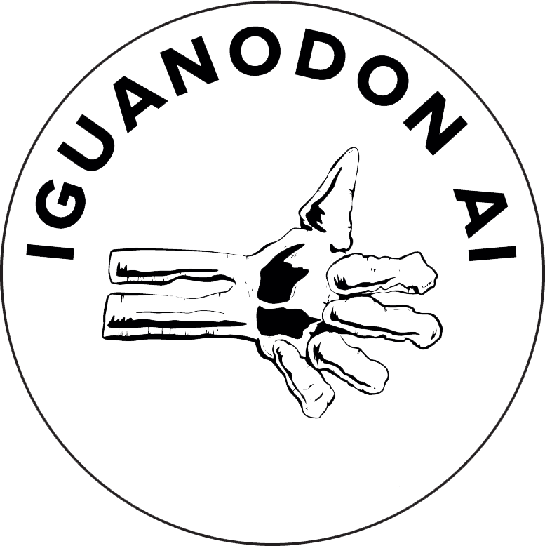

**Documentation about data-structure is available in [data-structure.md](data-structure.md)**
# Disclaimer

This code is the responsibility of its authors. This is not an official project of the Swedish Academy.

# Usage

## Requirements

This project uses [uv](https://docs.astral.sh/uv/) for dependency management.

## If you have a Python environment

`uv sync`

Create an `.env` file containing DB connection parameters (you can copy `env.sample` and edit the values)

`uv run python src/extract.py`

This writes the result to `entries.json` (in the current directory). You can
override the destination via the `OUTPUT` environment variable or as the first
CLI argument:

`uv run python src/extract.py my-entries.json`

## With Docker

`docker build -t so-db-extract:latest .`

Create an `.env` file containing DB connection parameters (you can copy `env.sample` and edit the values)

`docker compose up`

This will spin up mariadb. The first time you run this, it will ingest the SQL. Check logs to see it's correctly finished doing so, otherwise the command below will not work. If you need to kill the volume and start again, do `docker compose down -v`, delete the volume on this, and start again.

The `extractor` service writes `entries.json` into the `./out` directory on the host (mounted at `/app/out` in the container).

To run the extractor against an external database instead of the bundled one:

`docker run --env-file <your-env-file> -v "$PWD/out:/app/out" so-db-extract:latest`

## Clean-up script

`uv run python dedup_json.py <path_to_json>`

Resulting JSON will be written in `./entries_clean_nodraft.json`

# License and contact

This code was written by Simon Hengchen ([https://iguanodon.ai](https://iguanodon.ai)) upon the request of the Change is Key! team ([Change is Key!](https://changeiskey.org/)). The code is made available to the public [under the permissive CC BY-SA 4.0 license](http://creativecommons.org/licenses/by-sa/4.0/). If you use the data that running this script provides, use the following text snippet in the acknowledgments section of your paper:
> This work has been made possible by code created by `iguanodon.ai`. While the resource generated by this code is largely based on SO (https://svenska.se/so), it is not SO and significant deviations from the dictionary may occur.

 
